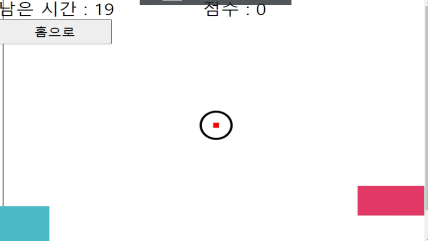

# Shoot_The_Div

## 마우스로 박스를 맞추는 게임

- 처음 HTML과 CSS에서 벗어나 Javascript를 배웠을때 이벤트를 사용해 뭘 만들어 볼 수 있을까 고민하다 만들어본 단순한 게임입니다.

### 사용 기술 스택

- HTML / CSS
- Javascript

### 소감

- 이전 Unity를 공부할때 구현했던 것들을 어느정도 옮길 수 있지 않을까 생각하게 된 프로젝트였습니다.

</img>
